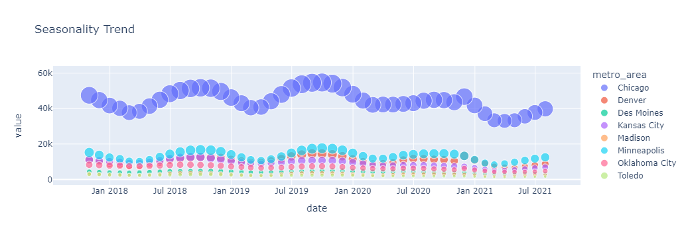
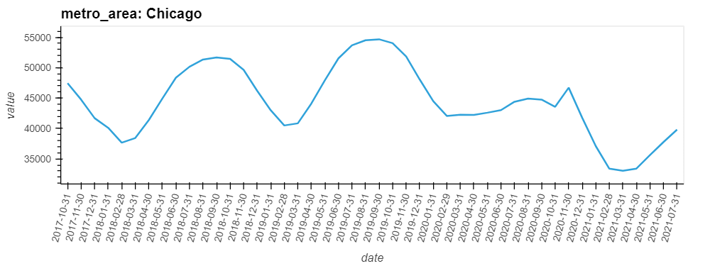
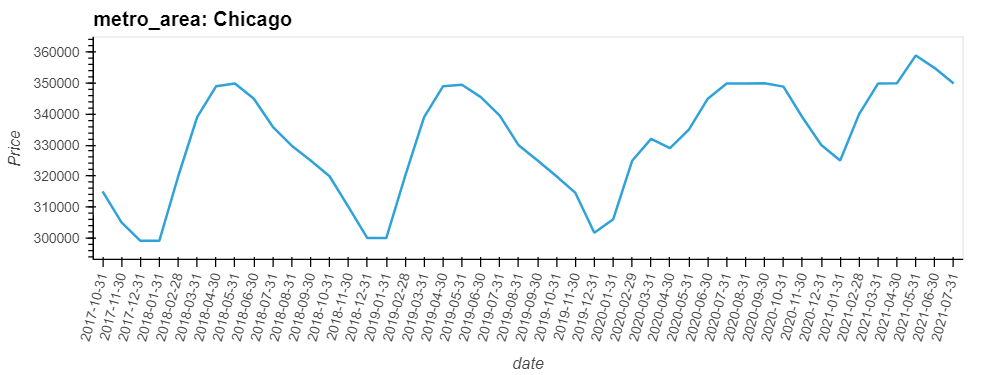
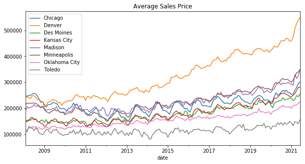
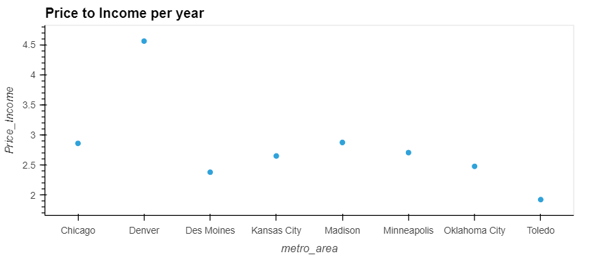
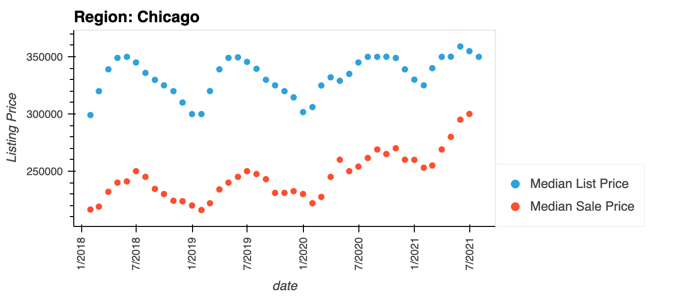
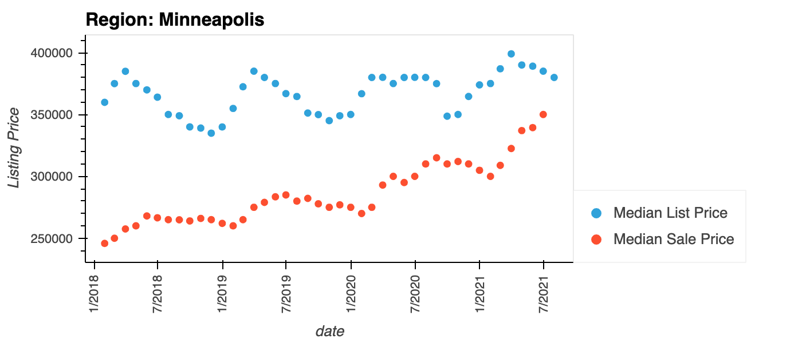
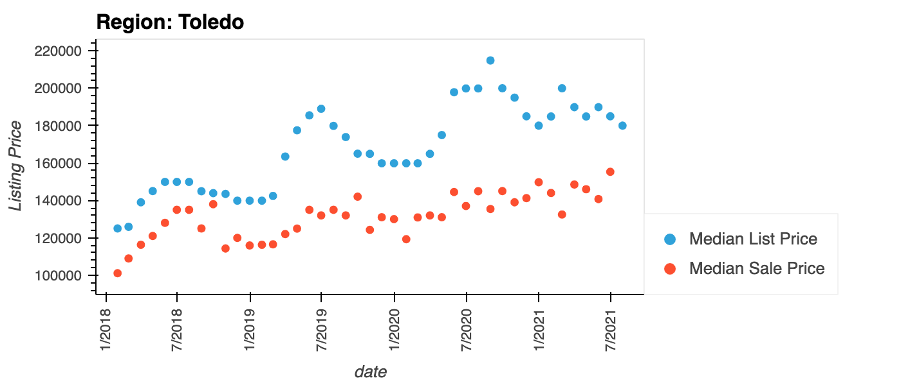

# About

----

This project will analyze the housing market in select cities in order to determine if there is seasonality to the housing market using market data to compare the average housing costs during specific timeframes since 2017. Additionally, we will compare housing prices to determine which housing market is most afforadble.  Finally, we will compare list price with sales price in each market to see when a homebuyer might pay a premium, get a discount or pay market value.  Our aim is to determine when the best time to buy a house is in select cities.

The Cities we have selected for this are:

* Chicago, IL
* Denver, CO
* Des Moines, IA
* Kansas City, MO
* Madison, WI
* Minneapolis, MN
* Oklahoma City, OK
* Toledo, OH


## Contributors

---

Kate Davis

Margee Lancaster

Servontius Turner


## About Our Data

---


For our project, we sourced our data from Zillow.com one of the nations largest third party Real Estate sites. We chose Zillow  for this reason and that it is one of the only Real Estate firms that offer and maintains a free API on listings. Real Estate does not (yet) have a central API to allow prospective analysts access to Real Estate information. Alot of provided APIs require the company to be a registered MLS company which requires a fee as well as a fee to access the API. Zillow offers a free API through Quandl as well as a more indepth and free API through a company called Bridge.

From the Quandl API we created multiple CSV files.  To create the files we defined the Metro Area by region ID and then defined indicator IDs for Inventory, Sale Price and List Price.  We then created a function for calling the data with the API to make the file creation easier

```python
def zillow_api_call(provider, indicator, region):
    requested_table = quandl.get_table(provider, indicator_id=indicator, region_id=region)
    return(requested_table)
```
From there we looped through each state and pulled the API data for the three metrics: Inventory, Sales Price and List Price

```python
for state in dict_metro_market:
    for indicator in dict_indicator_id:
        file_name = f"{state}_{indicator}.csv"
        zillow_table = zillow_api_call('ZILLOW/DATA', dict_indicator_id[indicator], dict_metro_market[state])
        zillow_table["region_id"] = zillow_table["region_id"].str.replace(str(dict_metro_market[state]), state)
        zillow_table = zillow_table.drop(columns=["indicator_id"])
        zillow_table = zillow_table.rename(columns={
            "region_id": "metro_area",
        })
        zillow_table.to_csv(f"{output_path}/{file_name}")
```

## Glob Functionality

---

To compile our data we used Glob function.  In Python, the glob module is used to retrieve files/pathnames matching a specified pattern. The pattern rules of glob follow standard Unix path expansion rules. According to benchmarks it is faster than other methods to match pathnames in directories.  We can use the function glob.glob() or glob.iglob() directly from glob module to retrieve paths recursively from inside the directories/files and subdirectories/subfiles.


## Does Seasonality impact inventory and sale prices 

---

Determine the seasonality for each metro area by reading in the Inventory CSV's for each Metro Area

```python
# Set the path for the csv files
path =r'C:/Users/kd_84/Working/Project 1/UMN_Project1/data'
filenames = glob.glob(path + "/*_Inventory.csv")
# Create dataframe for Inventory
dfs = []
for filename in filenames:
    dfs.append(pd.read_csv(filename))
all_df = pd.concat(dfs)
all_df.head()
# Create Scatter Plot to show seasonality of Inventory
px.scatter(
    all_df,
    x="date",
    y="value",
    size='value',
    color="metro_area",
    title="Seasonality Trend"
)
```




>1. From the Scatter plot above we determined that the further north the metro the more noticable trends in total inventory of housing.  
>2. Overall most markets saw an increase in inventory in the second quater increasing throughout the summer and peaking at the end of the third quarter.  Inventory declines in the fourth quarter and continued to decrease through the first quarter of the next year. 
>3. The smaller markets - Des Moines, Kansas City, Oklahoma City and Toledo all saw a significant decline in inventory beginning in early 2020, continued to decline throughout 2021 and hasn't rebounded yet.

Additionally, we wanted to understand if there were any correlation between inventory and listing price.  To accomplish this we read in the Inventory DataFrame and List Price DataFrame and plotted each onto a line chart.  

```python
# Set path for csv file
path =r'C:/Users/Users/kd_84/Working/Project 1/UMN_Project1/correlation_files'
filenames = glob.glob(path + "/*Inventory.csv")
# Created the dataframe
inv_dfs = []
for filename in filenames:
    inv_dfs.append(pd.read_csv(filename))
#concat
inventory = pd.concat(inv_dfs)
inventory = inventory.sort_values(by='date')
# Set path for csv file
path =r'C:/Users/kd_84/Working/Project 1/UMN_Project1/correlation_files'
filenames = glob.glob(path + "/*Price.csv")
# Created the dataframe
price_dfs = []
for filename in filenames:
    price_dfs.append(pd.read_csv(filename))
#concat
prices = pd.concat(price_dfs)
prices = prices.sort_values(by='date')
prices = prices.rename(columns={'value':'Price'})
```




We found that there is a correlation with inventory of homes and the listing price.  In every metro area when inventory is low the listing prices are high as well as when inventory is high the listing prices lower. 


## Which Metro Areas are most affordable

---

First we looked at the increase in home prices from 2008 to 2021:
```python
# Join all Metro Areas into a single DataFrame with columns for each City
combined_sale = [chicago_sale, denver_sale, des_moines_sale, kansas_city_sale, madison_sale, 
                 minneapolis_sale, oklahoma_city_sale, toledo_sale]
combined_final = functools.reduce(lambda left,right: pd.merge(left,right, on='date'), combined_sale)
combined_final.head()
```

| Index |       date | Chicago | Denver | Des Moines | Kansas City | Madison | Minneapolis | Oklahoma City | Toledo |
|------:|-----------:|--------:|-------:|-----------:|------------:|--------:|------------:|--------------:|-------:|
|     0 | 2021-06-30 |  300000 | 550000 |     255000 |      280000 |  347000 |      350000 |        225000 | 155300 |
|     1 | 2021-05-31 |  295000 | 540000 |     245000 |      281000 |  325000 |      339400 |        219000 | 140750 |
|     2 | 2021-04-30 |  280000 | 525500 |     249000 |      268000 |  315500 |      337000 |        213500 | 146000 |
|     3 | 2021-03-31 |  269000 | 505650 |     234300 |      257000 |  330000 |      322500 |        212000 | 148500 |
|     4 | 2021-02-28 |  255000 | 475000 |     229773 |      250000 |  289000 |      308900 |        210000 | 132450 |

```python
# Create line Chart to reflect average increase in sale price for each City
sales_price = combined_final.plot.line(x='date', title="Average Sales Price", figsize=(10,5))
```


>1. From 2008 to 2015 home sale prices stayed realtively flat with small increases each year.  Around 2016 sale prices have seen a steady increase in pricing.  A short synopsis for each city is listed below
>2. Toledo is the smallest market and had the smallest increase in home prices over the last 14 years. Kansas City, Oklahoma City, Madison and Des Moines round out the remaining small markets and the increase in home sales were similar for all three - increasing slightly with a sharper increase in the last 18 months.
>3. Chicago's home prices droped from 2008 to 2013 and have been on the risesince but it appears this housing market is much more volitile than any other city.  Minneapolis also saw a slight decrease in prices from 2008 through 2012 but has seen a steady increase since. The increase seems higher than the other cities and has seen a sharp increase since January 2021.
>4. Denver has seen a steady increase in home prices over the last 14 years with a sharper increase in the last 5 years.  Denver home prices have consistently been the highest of all markets.

Secondly we looked at the affordability of each city in comparison with the median income of those markets.  From the United States Census we were able to find the median family income for the 8 metro areas from 2017 through 2021

```python
# Reading Median Family Income csv
median_family_income_csv = "Data/Median_Family_Income_edit.csv"
family_income = pd.read_csv(median_family_income_csv, infer_datetime_format=True, parse_dates=True, index_col="date")
family_income.head(8)

# combine dataframes
joined = pd.merge(annual_2, family_income, how="inner", on=["date", "metro_area"], sort=True, copy=True, indicator=False, validate=None)
joined.head(8)

```
|       date |    metro_area |  value | avg_income_household |   |
|-----------:|--------------:|-------:|---------------------:|---|
| 2017-12-31 |       Chicago | 225833 |                79000 |   |
| 2017-12-31 |        Denver | 382546 |                83900 |   |
| 2017-12-31 |    Des Moines | 195571 |                82200 |   |
| 2017-12-31 |   Kansas City | 198150 |                74800 |   |
| 2017-12-31 |       Madison | 244862 |                85200 |   |
| 2017-12-31 |   Minneapolis | 244582 |                90400 |   |
| 2017-12-31 | Oklahoma City | 166688 |                67300 |   |
| 2017-12-31 |        Toledo | 118300 |                61500 |   |

```python
# compute the home price to income ratio
joined['Price_Income'] = (joined['value']/joined['avg_income_household'])
# joined['Price_Income'] = joined.Price_Income.round(decimals=2)
```
|       date |    metro_area |  value | avg_income_household | Price_Income |
|-----------:|--------------:|-------:|---------------------:|-------------:|
| 2017-12-31 |       Chicago | 225833 |                79000 |            3 |
| 2017-12-31 |        Denver | 382546 |                83900 |            5 |
| 2017-12-31 |    Des Moines | 195571 |                82200 |            2 |
| 2017-12-31 |   Kansas City | 198150 |                74800 |            3 |
| 2017-12-31 |       Madison | 244862 |                85200 |            3 |
| 2017-12-31 |   Minneapolis | 244582 |                90400 |            3 |
| 2017-12-31 | Oklahoma City | 166688 |                67300 |            2 |
| 2017-12-31 |        Toledo | 118300 |                61500 |            2 |



Year over year the most expensive market to live in was Denver and the least expesnive market was Toledo.  In 2021, Madison and Minneapolis saw the price to income ratio jump above 3 due to increases in home prices.


## Compare the list and sale price to find if buyers are buying at a premium or getting a discount

---

```python
# Set the path for the csv files
data_path = r'./data/'
sale_price_filenames = glob.glob(data_path + "/*_Sale_Price.csv")
list_price_filenames = glob.glob(data_path + "/*_List_Price.csv")

# Create two lists to be iterated through  to create the dataframe
sale_price_list = []
list_price_list = []

# Loop through each file name and append it to the corresponding list
for filename in sale_price_filenames:
    sale_price_list.append(pd.read_csv(filename, index_col="date", parse_dates=True, infer_datetime_format=True))

for filename in list_price_filenames:
    list_price_list.append(pd.read_csv(filename, index_col='date', parse_dates=True, infer_datetime_format=True))

# Create a new Dataframe by concatenating the data from each file in the list 
df_sale_price = pd.concat(sale_price_list)
df_list_price = pd.concat(list_price_list)

# Drop the 'None' Column from teh Dataframes and change the Column Names
#df_sale_price = df_sale_price.drop(columns=['None'])
df_sale_price = df_sale_price.rename(columns={
    'date': 'Date',
    'value': 'Sale Price',
    'metro_area': 'Region'
})

#df_list_price = df_list_price.drop(columns=['None'])
df_list_price = df_list_price.rename(columns={
    'date': 'Date',
    'value': 'Listing Price',
    'metro_area': 'Region'
})

# Create a new Column for the Year
df_sale_price['Year'] = df_sale_price.index.year
df_list_price['Year'] = df_list_price.index.year

# Set the value of the column Year to 2018 through 2021 when Zillow data was accessible
df_sale_price = df_sale_price['2018':'2021']
df_list_price = df_list_price['2018':'2021']

# Create Data visualization
sale_price_plot = df_sale_price.hvplot.scatter(x='date', y='Sale Price', label="Median Sale Price", groupby='Region', rot=90).opts(yformatter="%.0f")
list_price_plot = df_list_price.hvplot.scatter(x='date', y='Listing Price',label='Median List Price',groupby='Region',rot=90).opts(yformatter="%.0f")

list_price_plot * sale_price_plot
```




Looking at the plot above, we can see that on average, houses on Zillow do not sell near their list price. This could be due to Zillow's (Now former) market strategy of purchasing a house, pricing it exponentially higher than market value hoping a potential purchaser will bite, and lowering the price continually until it sells(per (Investopedia)|(https://www.investopedia.com/articles/personal-finance/110615/why-zillow-free-and-how-it-makes-money.asp). This means that potential buyers are getting a deal on property. The only time we see that the gap between the sale price and list price is in Toledo. Potential buyers are still getting a deal, however the deals there are not always that great when compared to Minneapolis or Chicago where the gap between Sale Price and List price is consistently higher than the other states.


# Problems that arised

---

>1. The main issue that we needed to resolve was working with GitHub fixing a merge conflict.  One of the local repos was pushed to the main branch instead of the individual branch.  This affected the data_collector.ipynb file and caused a merge conflict.  We resolved the merge conflicts in the GitHub GUI.  Once those were fixed we then pushed the correct files to Margee's local repo.
>2. We would have like to create dataframe to predict future home prices, if the increase in prices in the last 18 months had any correlation with the COVID 19 pandemic and if potentailly there will be a market correction in the near future.
